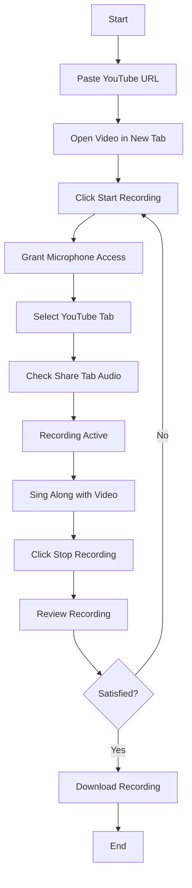
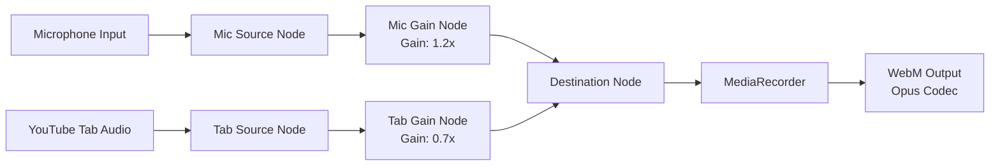

# 🎤 xsukax YouTube Karaoke Recorder

A privacy-first, client-side web application that enables users to record their voice alongside YouTube karaoke tracks with professional-quality audio mixing. Built with vanilla JavaScript and Web Audio API, this tool provides a seamless recording experience without any server-side processing or data transmission.

**🌐 Live Demo:** [https://xsukax.github.io/xsukax-YouTube-Karaoke-Recorder](https://xsukax.github.io/xsukax-YouTube-Karaoke-Recorder)

**📦 Repository:** [https://github.com/xsukax/xsukax-YouTube-Karaoke-Recorder](https://github.com/xsukax/xsukax-YouTube-Karaoke-Recorder)

---

## 📋 Project Overview

The xsukax YouTube Karaoke Recorder is a sophisticated browser-based application designed for karaoke enthusiasts who want to create high-quality recordings of their performances. By leveraging modern web APIs including Web Audio API, MediaRecorder, and getDisplayMedia, the application captures and mixes audio from both the user's microphone and YouTube video playback in real-time.

Unlike traditional karaoke recording solutions that require installation, server connections, or complex setup procedures, this application operates entirely within the browser, offering instant accessibility and zero configuration. The application intelligently balances audio levels by boosting vocal input (1.2x gain) while reducing background music (0.7x gain), ensuring that the user's voice remains prominent in the final recording.

The tool bypasses YouTube's embedding restrictions by opening videos in a separate browser tab and utilizing the screen capture API to access the tab's audio stream. This innovative approach enables compatibility with any YouTube video, including those that disable embedded playback, making the entire YouTube karaoke library accessible to users.

---

## 🔒 Security and Privacy Benefits

The xsukax YouTube Karaoke Recorder has been architected with privacy and security as foundational principles. The application implements a comprehensive zero-trust model where no user data ever leaves the local device:

### Complete Client-Side Processing
All audio capture, mixing, processing, and recording operations are performed entirely within the user's browser using native Web APIs. There are no backend servers, databases, or cloud services involved in any stage of the recording workflow. This architecture eliminates risks associated with data interception, unauthorized access, or server-side breaches.

### No Data Transmission
The application does not transmit any audio data, user information, or metadata to external servers. YouTube videos are accessed directly through the browser's native navigation, and audio capture occurs through standard browser APIs without any intermediary services. Users maintain complete control over their recordings, which remain stored locally in browser memory until explicitly downloaded.

### Minimal Permission Model
The application requests only two essential permissions: microphone access for vocal recording and display capture for YouTube tab audio. These permissions are requested on-demand and can be revoked at any time through browser settings. The application does not request access to file systems, location data, contacts, or any other sensitive information beyond what is strictly necessary for its core functionality.

### Transparent Source Code
As an open-source project, the entire codebase is publicly available for audit and verification. Users and security researchers can inspect the source code to validate that no hidden data collection, tracking, or unauthorized transmission occurs. The single-file HTML architecture ensures complete transparency with no obfuscated or minified code.

### No Tracking or Analytics
The application does not implement any analytics services, tracking pixels, cookies, or telemetry. User behavior, recording statistics, and usage patterns are never logged or monitored. Each session is completely isolated with no persistent identifiers or cross-session tracking mechanisms.

### Local-Only Storage
Recordings are temporarily held in browser memory and exist only as Blob objects until the user chooses to download them. The application does not utilize localStorage, sessionStorage, IndexedDB, or any persistent storage mechanism that could create privacy concerns or enable tracking across sessions.

### Secure Audio Processing
Audio mixing is performed using the Web Audio API's native AudioContext, which operates in an isolated environment with built-in security boundaries. The MediaRecorder API ensures that recordings are encoded securely using industry-standard codecs (Opus in WebM container) without introducing vulnerabilities.

---

## ✨ Features and Advantages

### Universal YouTube Compatibility
- **Zero Embedding Restrictions**: Works with all YouTube videos regardless of embed settings, including videos marked as "embedding disabled"
- **Complete Library Access**: Record with official music videos, lyric videos, karaoke tracks, and any other YouTube content
- **Live Stream Support**: Compatible with YouTube live streams and premieres

### Professional Audio Quality
- **Real-Time Audio Mixing**: Utilizes Web Audio API for low-latency, high-fidelity audio processing
- **Intelligent Gain Control**: Automatic vocal boost (1.2x) and music reduction (0.7x) for optimal balance
- **High-Quality Encoding**: Opus codec in WebM container provides excellent quality at efficient bitrates
- **Zero Latency Monitoring**: Synchronous mixing ensures perfect timing between vocals and backing track

### User-Friendly Interface
- **Intuitive Workflow**: Streamlined five-step process from video selection to download
- **Visual Feedback**: Real-time waveform animations indicate active audio capture
- **Recording Timer**: Displays elapsed time during recording sessions
- **Multiple Recordings**: Create and manage unlimited recordings within a single session
- **Responsive Design**: Tailwind CSS-based interface adapts seamlessly to all screen sizes

### Technical Advantages
- **Single File Deployment**: Entire application contained in one self-contained HTML file
- **No Dependencies**: Requires no external libraries, frameworks, or modules
- **Zero Installation**: Runs directly in modern browsers without plugins or extensions
- **Cross-Platform**: Compatible with Windows, macOS, Linux, iOS, and Android
- **Browser Optimized**: Specifically enhanced for Chrome and Edge Chromium-based browsers

### Privacy-First Design
- **Offline Capable**: Once loaded, can function without internet connectivity (except for YouTube access)
- **No Registration**: No accounts, logins, or personal information required
- **Instant Disposal**: All data cleared when browser tab is closed
- **User Sovereignty**: Complete control over recording data and privacy settings

---

## 🚀 Installation Instructions

The xsukax YouTube Karaoke Recorder requires no traditional installation process. The application is a standalone HTML file that can be deployed and accessed through multiple methods:

### Method 1: GitHub Pages (Recommended)
1. Fork the repository to your GitHub account
2. Navigate to repository Settings → Pages
3. Select the main branch as the source
4. Access the application at `https://[your-username].github.io/xsukax-YouTube-Karaoke-Recorder`

### Method 2: Local Hosting with Web Server
1. Clone the repository:
   ```bash
   git clone https://github.com/xsukax/xsukax-YouTube-Karaoke-Recorder.git
   cd xsukax-YouTube-Karaoke-Recorder
   ```

2. Start a local web server using any of these options:

   **Python 3:**
   ```bash
   python -m http.server 8000
   ```

   **Node.js (http-server):**
   ```bash
   npx http-server -p 8000
   ```

   **PHP:**
   ```bash
   php -S localhost:8000
   ```

3. Open your browser and navigate to `http://localhost:8000`

### Method 3: Direct File Access
1. Download `index.html` from the repository
2. Double-click the file to open in your default browser
3. **Note**: Some features may be limited due to browser security policies when accessing files directly. Web server hosting is recommended for full functionality.

### Browser Requirements
- **Recommended**: Google Chrome 94+ or Microsoft Edge 94+
- **Supported**: Firefox 90+, Safari 15+, Opera 80+
- **Required Features**: Web Audio API, MediaRecorder API, getDisplayMedia API support

### PHP Configuration
**N/A** - This application is a static HTML file and does not require PHP or server-side configuration. If hosting through PHP's built-in server as shown above, no php.ini modifications are necessary.

---

## 📖 Usage Guide

### Workflow Overview

The recording process follows a straightforward five-step workflow designed for maximum efficiency and ease of use:



### Step-by-Step Instructions

#### Step 1: Load YouTube Video
1. Open the application in your browser
2. Locate a YouTube karaoke video you wish to record with
3. Copy the video URL from the browser address bar
4. Paste the URL into the "YouTube Video URL" input field
5. Click the **"Open Video"** button
6. A new browser tab will open with your selected video
7. The application interface will display "Video Tab Active" status

**Supported URL Formats:**
- `https://www.youtube.com/watch?v=VIDEO_ID`
- `https://youtu.be/VIDEO_ID`
- `https://www.youtube.com/embed/VIDEO_ID`
- `https://www.youtube.com/shorts/VIDEO_ID`
- `https://www.youtube.com/live/VIDEO_ID`

#### Step 2: Initiate Recording
1. Click the **"Start Recording"** button in the application
2. A browser permission dialog will appear requesting microphone access
3. Click **"Allow"** to grant microphone permission
4. The microphone status indicator will change to "Connected" with a green badge
5. An instruction modal will appear explaining the tab capture process
6. Read the instructions carefully and click **"Continue"**

#### Step 3: Capture YouTube Audio
1. A screen sharing dialog will appear with three options: "Entire Screen", "Window", and "Tab"
2. Click the **"Tab"** option
3. Select the YouTube tab from the preview list (identified by the video thumbnail)
4. **CRITICAL**: Check the "Share tab audio" checkbox at the bottom of the dialog
5. Click the **"Share"** button to begin capture
6. The YouTube audio status indicator will change to "Captured" with a green badge

**Troubleshooting Tab Capture:**
- If no audio is captured, ensure "Share tab audio" was checked before clicking Share
- If the checkbox is not visible, your browser may not support tab audio capture
- Try using Chrome or Edge for best compatibility

#### Step 4: Record Your Performance
1. Switch to the YouTube video tab
2. Start playing the video at your desired point
3. The application will display "Recording in progress" with a pulsing red indicator
4. The recording timer will show elapsed time
5. Sing along with the karaoke track
6. Your voice and the YouTube audio are being mixed in real-time

**Recording Tips:**
- Position your microphone 6-12 inches from your mouth
- Maintain consistent distance for even vocal levels
- Minimize background noise for clearer recordings
- Monitor the waveform indicators to confirm audio capture

#### Step 5: Stop and Save
1. When finished singing, return to the application tab
2. Click the **"Stop Recording"** button
3. The application will process and finalize your recording
4. Your new recording will appear in the "Your Recordings" section
5. Click the **"Download Recording"** button to save the file
6. The recording will be saved as `xsukax-karaoke-[timestamp].webm`

### Audio Mixing Architecture

The application employs a sophisticated audio processing pipeline to achieve professional-quality results:



### Managing Recordings

**Playback:**
- Each recording includes an embedded audio player
- Click play to preview your recording before downloading
- Use browser audio controls for volume adjustment

**Downloading:**
- Click the "Download Recording" button beneath any recording
- Files are saved in WebM format with Opus audio codec
- Default filename format: `xsukax-karaoke-[timestamp].webm`

**Deleting:**
- Click the "Delete" button to remove unwanted recordings
- Deletion is immediate and cannot be undone
- Deleted recordings are removed from browser memory

**Converting Format:**
- WebM files can be converted to MP3 or other formats using:
  - FFmpeg: `ffmpeg -i input.webm -c:a libmp3lame -b:a 192k output.mp3`
  - Online converters (CloudConvert, Convertio, etc.)
  - Desktop software (Audacity, VLC Media Player)

### Advanced Features

**Recording Timer:**
- Displays real-time elapsed time in MM:SS format
- Helps track recording length for sharing or time limits
- Updates every second during active recording

**Status Indicators:**
- Visual waveform animations confirm active audio capture
- Color-coded status badges indicate system states
- Recording indicator pulses during active sessions

**Multiple Sessions:**
- Create unlimited recordings within a single browser session
- Each recording maintains independent playback controls
- All recordings cleared when browser tab is closed

### Best Practices

**For Optimal Audio Quality:**
- Use a quality microphone or headset with built-in mic
- Record in a quiet environment with minimal echo
- Test your setup with a short recording before the full performance
- Keep consistent distance from the microphone throughout

**For Browser Performance:**
- Close unnecessary browser tabs to free system resources
- Ensure stable internet connection for YouTube streaming
- Use wired internet connection instead of WiFi when possible
- Allow browser to use hardware acceleration (check browser settings)

**For Privacy:**
- Close the browser tab when finished to clear all recordings
- Do not use on shared or public computers without clearing browser data
- Remember that recordings exist only in browser memory until downloaded

---

## 📄 License

This project is licensed under the GNU General Public License v3.0.

---

## 🙏 Acknowledgments

- Built with Web Audio API, MediaRecorder API, and getDisplayMedia API
- Styled with Tailwind CSS via CDN
- Created by xsukax with a focus on privacy and user experience

---

## 🐛 Issues and Contributions

Found a bug or have a feature request? Please open an issue on the [GitHub repository](https://github.com/xsukax/xsukax-YouTube-Karaoke-Recorder/issues).

Contributions are welcome! Feel free to submit pull requests for improvements, bug fixes, or new features.

---

**⭐ If you find this project useful, please consider giving it a star on GitHub!**
